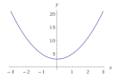
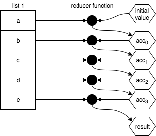

---


---
- Read through saved references
- Read through saved instapaper articles
- Watch saved talks
- Add a why Ramda slide
  - auto curried
  - arguments in correct order (like lodash/fp)
- recompose compose function
- add speakers nodes
- last 2 slides about monads and sanctuary js
- method chaining vs compositional style ()

---
> The best way to predict the future is to invent it
-- Alan Kay

---
# `f(RG)`
- Why fp?
- Mental models
- A beginner's perspective on some basic fp concepts
- General introduction
- Language features
- Currying/composition

^
Testing some speaker notes

---

# why fp
-

---

# functional programming is about functions
- How we use functions that make our code functional
- Function in the mathematical sense
- Inputs and outputs

---


---

# first class and higher order functions (slide about how JS language features enable functional concepts)
- Like haskell/lisps/erlang
- Allows functions as arguments, stored in arrays, assigned to variables
- This enables fun stuff like currying, pure functions
- Referential transparency: pure function is called with arguments that cause no side effects, the result is constant with respect to that argument list.

---

# array (list) operations
- functional bread and butter
- map/filter/reduce

---
# imperative vs declarative
- quick hands up
- imperative = how you want to achieve
- declarative = describing what you want to achieve

---
# non-FP list operations
- forEach(..)
- designed for each function call to operate with side effects (push to array, modify object etc.)

---
# map
## map :: (arr, mapperFn) -> newArr
- value -> newValue

e.g. single value transformation

```javascript
var multipleBy3 = v => v * 3;
var x = 2, y; // y = undefined

// transformation / projection
y = multiplyBy3(x);
```

---
# map
multiple value transformation


- use map from lodash/lodash-fp to avoid 3rd this argument
- https://developer.mozilla.org/en-US/docs/Web/JavaScript/Reference/Global_Objects/Array/Map

---
# map
```javascript

// imperative
let makes = [];
for (var i = 0; i < cars.length; i++) {
  makes.push(cars[i].make);
}


// declarative
const fp = require('lodash/fp');
var R = require('ramda'); // automatically curried by default, returns itself if called with no arguments
const makes = R.map(car => car.make, cars);
```

---
# filter
## filter :: (arr, predicateFn) -> newArr
- filter out unwanted stuff
- takes a function to decide if each value in the original array should be in the new array


---
# filter
```javascript
var isOdd = v => v % 2 == 1;

// without filter
var midIdx;

if (isOdd( list.length )) {
    midIdx = (list.length + 1) / 2;
}
else {
    midIdx = list.length / 2;
}

// with filter
[1, 2, 3, 4, 5].filter(isOdd);
// [1, 3, 5]

// with lodash
// filter(isOdd, [1, 2, 3, 4, 5]);

// extra
[1, 2, 3, 4, 5].filter(_.negate(isOdd));
```

---
# reduce
## reduce :: (arr, reducerFn, initialValue) -> acc


---
# reduce
```javascript
var hyphenate = (str,char) => str + "-" + char;

["a","b","c"].reduce(hyphenate);
// "a-b-c"

["a","b","c"].reduceRight( hyphenate );
// "c-b-a"
```

---
# Currying (aka partial application)
## curry :: (* → a) → (* → a)
- the process of converting functions that take multiple arguments into ones
that, when supplied with fewer arguments, return new functions that accept the remaining ones.

- partially applying known arguments to a function and getting a new function back

---
# Currying
## example, curried with an arity of one

```javascript
const printTwoWords = one => two => console.log(`${one} ${two}`);
const blueThings = printTwoWords('blue');
// function (two) {
//    return console.log(`${one} ${two}`);
//  }

blueThings('chairs');
// blue chairs

// Can still do
printTwoWords('one', 'two');
```

---
# Currying
## data last

```javascript
var match = curry(function(what, str) {
  return str.match(what);
});

var filter = curry(function(f, ary) {
  return ary.filter(f);
});

var hasSpaces = match(/\s+/g);
// function(x) { return x.match(/\s+/g) }

hasSpaces('hello world');
//  [ ' ' ]

filter(hasSpaces, ['tori_spelling', 'tori amos']);
// ['tori amos']

```
- this demonstrates the ability to pre-load a function with an argument or 2 in order
to receive a function that remembers those arguments.

---
# composition
## ```compose :: (f, g) -> (x) -> f(g(x))```
In mathematics f ∘ g (f composed with g) is the function that given x, returns f(g(x)).

---
# composition
```javascript
const toUpperCase = x => x.toUpperCase();
const exlcaim = x => `${x}!`;

const shout = compose(exclaim, toUpperCase);
shout('send in the scientists');
// "SEND IN THE SCIENTISTS!"
```

- the composition of two functions returns a new function
- functions run right to left, the g will run before the f

---
# composition
- an example where order matters

```javascript
const head = x => x[0];
const reverse = reduce((acc, x) => [x].concat(acc), []);
const last = compose(head, reverse);

last(['jumpkick', 'roundhouse', 'uppercut']);
// 'uppercut'
```

- associative vs variadic
- we order by least often to most often changed, this style enables composition. http://www.fse.guru/how-do-i-learn-some-fp/

---

## Use a __*mixture*__ of **strong** and _emphasis_ for _**maximum**_ impact!

---
